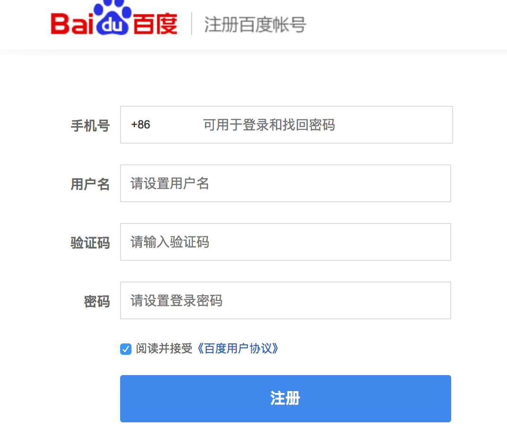
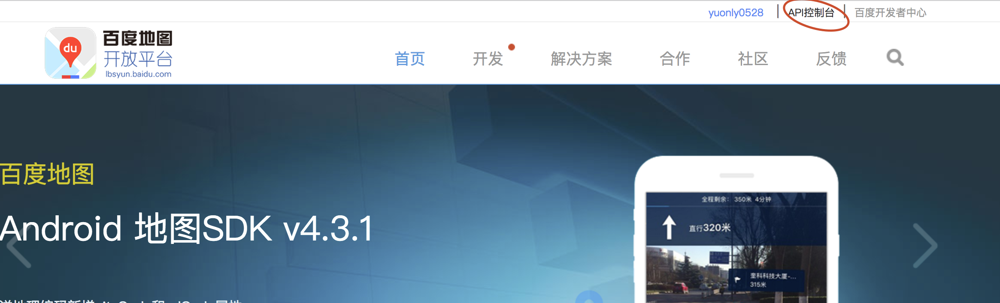
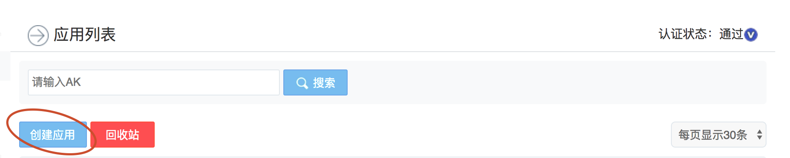
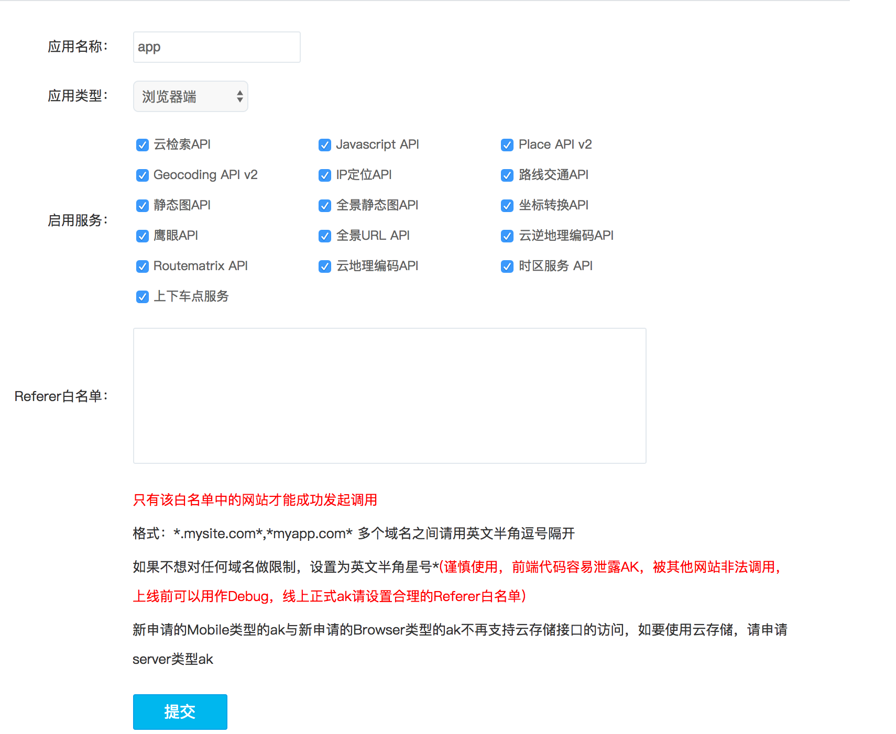

### 开发准备

#### 1 注册百度地图账号

        http://lbsyun.baidu.com/

#### 2 进入控制台

#### 3 创建应用

#### 2 获取key

* 先创建应用
* 然后申请key：一般3-5个工作日

### 开发文档

http://lbsyun.baidu.com/index.php?title=jspopular

### 起步引入百度地图api 详细参见文档 http://lbsyun.baidu.com/index.php?title=jspopular/guide/introduction

#### 1 PC端

#### 2 移动端

* 将地图容器高设置为100%，使其充满整个屏幕，或者您也可以计算浏览器窗口的大小并进行设置。
* 添加下面的meta标签： <meta name="viewport" content="initial-scale=1.0, user-scalable=no" /> 这样做是为了让页面以正常比例进行显示并且禁止用户缩放页面的操作。

### 我的第一个百度地图  详见 http://lbsyun.baidu.com/index.php?title=jspopular/guide/helloworld

> 01/helloworld.html

### 控件 01/control.html

* Control：控件的抽象基类，所有控件均继承此类的方法、属性。通过此类您可实现自定义控件。
* NavigationControl：地图平移缩放控件，PC端默认位于地图左上方，它包含控制地图的平移和缩放的功能。移动端提供缩放控件，默认位于地图右下方。
* OverviewMapControl：缩略地图控件，默认位于地图右下方，是一个可折叠的缩略地图。
* ScaleControl：比例尺控件，默认位于地图左下方，显示地图的比例关系。
* MapTypeControl：地图类型控件，默认位于地图右上方。
* CopyrightControl：版权控件，默认位于地图左下方。
* GeolocationControl：定位控件，针对移动端开发，默认位于地图左下方。

#### 1 向地图添加控件

        实例化地图
        var map = new BMap.Map("container");    
        设置坐标点及地图级别
        map.centerAndZoom(new BMap.Point(116.404, 39.915), 11);    
        使用 addControl 添加控件
        map.addControl(new BMap.NavigationControl());

### 覆盖物

> 官方文档：http://lbsyun.baidu.com/index.php?title=jspopular/guide/cover

* Overlay：覆盖物的抽象基类，所有的覆盖物均继承此类的方法。
* Marker：标注表示地图上的点，可自定义标注的图标。
* Label：表示地图上的文本标注，您可以自定义标注的文本内容。
* Polyline：表示地图上的折线。
* Polygon：表示地图上的多边形。多边形类似于闭合的折线，另外您也可以为其添加填充颜色。
* Circle: 表示地图上的圆。
* InfoWindow：信息窗口也是一种特殊的覆盖物，它可以展示更为丰富的文字和多媒体信息。注意：同一时刻只能有一个信息窗口在地图上打开。
> 可以使用map.addOverlay方法向地图添加覆盖物，使用map.removeOverlay方法移除覆盖物，注意此方法不适用于InfoWindow。

#### 1 标注地图上的点

        var map = new BMap.Map("container");    
        var point = new BMap.Point(116.404, 39.915);    
        map.centerAndZoom(point, 15);    
        var marker = new BMap.Marker(point);        // 创建标注    
        map.addOverlay(marker);                     // 将标注添加到地图中

#### 2 添加覆盖物 01/cover1.html

#### 3 设置点的跳动 01/cover2.html

#### 4 设置新图标 01/cover3.html

> 更多demo 详见 http://lbsyun.baidu.com/jsdemo.htm#c1_16

### 事件

> 浏览器中的JavaScript是“事件驱动的”，这表示JavaScript通过生成事件来响应交互，并期望程序能够“监听”感兴趣的活动。例如，在浏览器中，用户的鼠标和键盘交互可以创建在DOM内传播的事件。对某些事件感兴趣的程序会为这些事件注册JavaScript事件监听器，并在接收这些事件时执行代码。
百度地图API拥有一个自己的事件模型，程序员可监听地图API对象的自定义事件，使用方法和DOM事件类似。但请注意，地图API事件是独立的，与标准DOM事件不同。

        var map = new BMap.Map("container");    
            map.centerAndZoom(new BMap.Point(116.404, 39.915), 11);
            //通过addEventListener添加事件   
            map.addEventListener("click", function(){    
            alert("您点击了地图。");    
        });

#### 1 图块加载完成事件 01/event1.html

#### 2 地图单击事件 01/event2.html

#### 3 给覆盖物注册事件 01/event3.html

### GPS功能

#### 1 单个标注点沿直线的轨迹运动 01/gps1.html

#### 2 多个点沿直线运动 01/gps2.html

#### 3 路书 01/gps3.html

### 检索功能

        使用local.search实现搜索功能

        var map = new BMap.Map("allmap");
        map.centerAndZoom(new BMap.Point(116.404, 39.915), 11);
        var local = new BMap.LocalSearch(map, {
          renderOptions: {
            map: map
          }
        });
        local.search("景点");

#### 1 但关键字搜索 02/search1.html

#### 2 多关键字搜索 02/search2.html

#### 3 矩形区域搜索 02/search3.html

#### 4 圆形区域搜索 02/search4.html

#### 5 本地搜索的结果面板展示 02/search5.html

#### 6 本地搜索的数据接口 02/search6.html

#### 7 lbs云数据 02/search7.html

### 定位

#### 1 浏览器定位 03/position1.html
#### 2 根据ip定位 03/position2.html
#### 3 根据城市名定位 03/position3.html
#### 4 根据经纬度定位 03/position4.html
